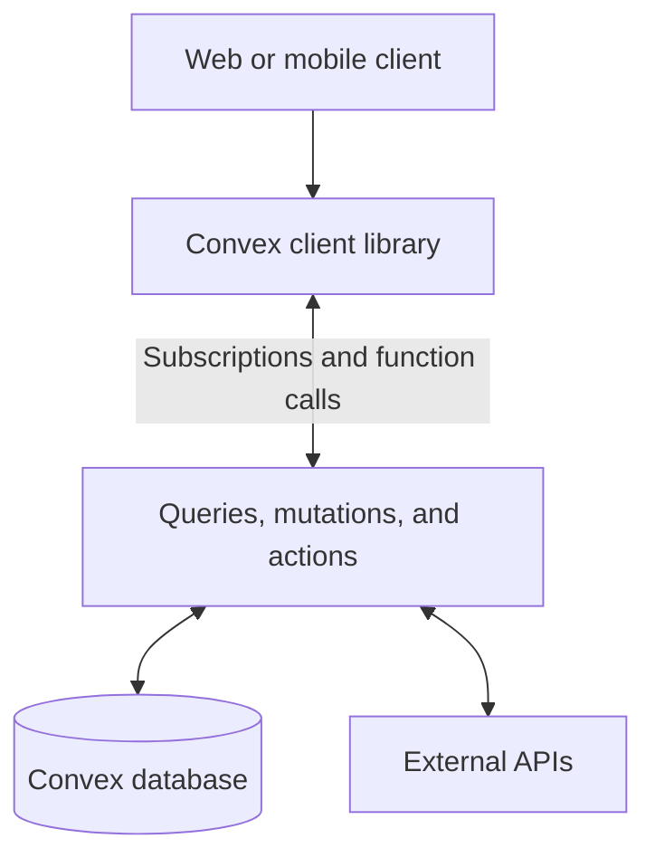
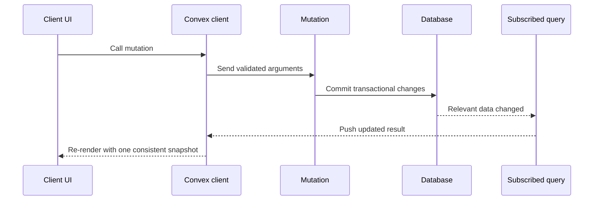

# Convex: A Practical Overview

Convex is an open-source **reactive backend platform** for web and mobile applications. It combines a document-relational database, TypeScript server functions, real-time synchronization, scheduling, file storage, authentication integrations, and deployment tooling.

Instead of assembling a database, API server, cache, WebSocket layer, and background-job system separately, Convex provides those capabilities as one coordinated backend.

> **In one sentence:** Convex lets a frontend subscribe to TypeScript queries whose results update automatically whenever the underlying database data changes.

---

## Table of Contents

1. [What Problem Convex Solves](#1-what-problem-convex-solves)
2. [Core Architecture](#2-core-architecture)
3. [The Database](#3-the-database)
4. [Schemas and Validation](#4-schemas-and-validation)
5. [Queries, Mutations, and Actions](#5-queries-mutations-and-actions)
6. [Reactivity and Real-Time Updates](#6-reactivity-and-real-time-updates)
7. [Indexes and Query Performance](#7-indexes-and-query-performance)
8. [Authentication and Authorization](#8-authentication-and-authorization)
9. [File Storage](#9-file-storage)
10. [Scheduling and Background Work](#10-scheduling-and-background-work)
11. [HTTP Endpoints and External Services](#11-http-endpoints-and-external-services)
12. [Local Development and Deployment](#12-local-development-and-deployment)
13. [A Small End-to-End Example](#13-a-small-end-to-end-example)
14. [Consistency and Error Handling](#14-consistency-and-error-handling)
15. [Search, Pagination, and Other Capabilities](#15-search-pagination-and-other-capabilities)
16. [Advantages and Trade-offs](#16-advantages-and-trade-offs)
17. [When to Use Convex](#17-when-to-use-convex)
18. [Convex Compared with Common Alternatives](#18-convex-compared-with-common-alternatives)
19. [Best Practices](#19-best-practices)
20. [Key Takeaways](#20-key-takeaways)

---

## 1. What Problem Convex Solves

A conventional real-time application may need several independent pieces:

- A database such as PostgreSQL or MongoDB.
- A backend API written with Express, Fastify, Next.js, or another framework.
- An ORM or query builder.
- A cache for frequently requested data.
- WebSockets or a subscription server for live updates.
- A queue and workers for background jobs.
- Object storage for uploaded files.
- Authentication and authorization logic.
- Deployment, monitoring, and environment management.

Each piece can be a good tool, but the application team must keep them synchronized. A database write may need to invalidate a cache, notify connected clients, enqueue work, and preserve a consistent user interface.

Convex reduces this coordination work. Database queries are backend TypeScript functions. Clients subscribe to query results, and Convex automatically recomputes and pushes new results when relevant data changes.

This makes Convex especially attractive for applications such as:

- Chat and collaboration tools.
- Live dashboards.
- Multiplayer or shared-state experiences.
- Project-management systems.
- AI applications that combine persistent state with external model calls.
- Products where the frontend must react immediately to backend changes.

---

## 2. Core Architecture

A typical Convex application has three layers:



### Client libraries

Convex provides clients for frameworks and environments including React. The client calls generated backend APIs and maintains subscriptions to query results.

### Server functions

Backend logic lives in the project's `convex/` directory. Convex generates a typed API from the functions exported there, so argument and return types can flow from the backend into the frontend.

### Database

The database stores JSON-like documents in tables. Documents can reference one another through typed document IDs, combining aspects of document and relational data models.

### Managed synchronization

The reactive query system tracks which data a query reads. When a mutation changes relevant data, subscribed query results are recomputed and delivered to clients.

---

## 3. The Database

Convex describes its database as **document-relational**:

- **Document:** records are JSON-like objects and may contain nested values and arrays.
- **Relational:** records live in tables and can reference records in other tables by ID.

Every stored document automatically receives:

- `_id`: a typed identifier for that table.
- `_creationTime`: the document's creation timestamp.

### Basic operations

Inside a mutation, the database API supports operations such as:

```ts
const taskId = await ctx.db.insert("tasks", {
  title: "Review DDIA chapter 3",
  completed: false,
});

const task = await ctx.db.get(taskId);

await ctx.db.patch(taskId, { completed: true });

await ctx.db.replace(taskId, {
  title: "Review DDIA chapter 3 again",
  completed: true,
});

await ctx.db.delete(taskId);
```

| Operation | Purpose |
|---|---|
| `insert` | Create a document and return its ID |
| `get` | Retrieve one document by ID |
| `patch` | Update selected fields |
| `replace` | Replace the document's user-defined fields |
| `delete` | Remove a document |

### Relationships

A document can store another document's ID:

```ts
{
  title: "Read chapter 8",
  ownerId: Id<"users">
}
```

Convex does not automatically perform SQL-style joins. A query loads related documents in TypeScript, which makes the data access explicit but can require careful modeling for large relationship graphs.

---

## 4. Schemas and Validation

Schemas are optional, but most production applications benefit from defining one in `convex/schema.ts`.

```ts
import { defineSchema, defineTable } from "convex/server";
import { v } from "convex/values";

export default defineSchema({
  users: defineTable({
    name: v.string(),
    email: v.string(),
  }).index("by_email", ["email"]),

  tasks: defineTable({
    ownerId: v.id("users"),
    title: v.string(),
    completed: v.boolean(),
    priority: v.optional(v.number()),
  })
    .index("by_owner", ["ownerId"])
    .index("by_owner_and_completed", ["ownerId", "completed"]),
});
```

Validators provide runtime validation and TypeScript types. Common validators include:

| Validator | Accepts |
|---|---|
| `v.string()` | Strings |
| `v.number()` | Numbers |
| `v.boolean()` | Booleans |
| `v.id("table")` | IDs from a specific table |
| `v.array(...)` | Arrays of validated values |
| `v.object({...})` | Nested objects |
| `v.optional(...)` | An optional field |
| `v.union(...)` | One of several allowed shapes |
| `v.literal(...)` | One exact value |

Function arguments should also be validated. Client-supplied TypeScript types disappear at runtime; validators enforce the boundary on the server.

---

## 5. Queries, Mutations, and Actions

Convex has three primary function types. Choosing the correct one is central to using the platform well.

| Capability | Query | Mutation | Action |
|---|---:|---:|---:|
| Read the database directly | Yes | Yes | No |
| Write the database directly | No | Yes | No |
| Transactional | Yes | Yes | No |
| Reactive and cached | Yes | No | No |
| Call external APIs | No | No | Yes |
| Automatically retry conflicts | Not applicable | Yes | No |

### Queries

A **query** is a deterministic, read-only function. Its result can be cached and subscribed to.

```ts
import { query } from "./_generated/server";
import { v } from "convex/values";

export const listForOwner = query({
  args: { ownerId: v.id("users") },
  handler: async (ctx, { ownerId }) => {
    return await ctx.db
      .query("tasks")
      .withIndex("by_owner", (q) => q.eq("ownerId", ownerId))
      .collect();
  },
});
```

Queries cannot perform non-deterministic work such as calling an arbitrary external API. This restriction allows Convex to cache, rerun, and reason about them safely.

### Mutations

A **mutation** reads and writes database state in one transaction.

```ts
import { mutation } from "./_generated/server";
import { v } from "convex/values";

export const toggle = mutation({
  args: { taskId: v.id("tasks") },
  handler: async (ctx, { taskId }) => {
    const task = await ctx.db.get(taskId);
    if (task === null) throw new Error("Task not found");

    await ctx.db.patch(taskId, { completed: !task.completed });
  },
});
```

The entire handler is the transaction. If it throws, its writes are rolled back. Convex uses optimistic concurrency control and automatically retries mutations when safe transaction conflicts occur.

### Actions

An **action** performs non-transactional work such as calling an LLM, payment provider, or email service.

```ts
import { action } from "./_generated/server";
import { v } from "convex/values";

export const fetchBook = action({
  args: { isbn: v.string() },
  handler: async (_ctx, { isbn }) => {
    const response = await fetch(`https://openlibrary.org/isbn/${isbn}.json`);
    if (!response.ok) throw new Error("Book request failed");
    return await response.json();
  },
});
```

Actions do not access the database directly. They call internal queries or mutations through `ctx.runQuery` and `ctx.runMutation`. Because external side effects cannot always be repeated safely, actions are not automatically retried in the same way as mutations.

### Public and internal functions

Functions exported with `query`, `mutation`, or `action` are part of the public API. Backend-only operations should use `internalQuery`, `internalMutation`, or `internalAction` so clients cannot invoke them directly.

---

## 6. Reactivity and Real-Time Updates

Reactivity is Convex's defining feature.

In React, `useQuery` subscribes a component to a backend query:

```tsx
import { useQuery } from "convex/react";
import { api } from "../convex/_generated/api";

export function TaskList({ ownerId }: { ownerId: Id<"users"> }) {
  const tasks = useQuery(api.tasks.listForOwner, { ownerId });

  if (tasks === undefined) return <p>Loading...</p>;

  return (
    <ul>
      {tasks.map((task) => (
        <li key={task._id}>{task.title}</li>
      ))}
    </ul>
  );
}
```

The update flow is:



Convex tracks a query's data dependencies, invalidates its cached result when those dependencies change, reruns it, and pushes the result over the client connection. The application does not manually maintain WebSocket channels or cache-invalidation rules.

This does not mean every computation belongs in one enormous query. Small, indexed queries are easier to secure, reuse, and keep performant.

---

## 7. Indexes and Query Performance

Convex queries should use indexes when selecting a subset of a growing table.

```ts
// schema.ts
defineTable({
  ownerId: v.id("users"),
  completed: v.boolean(),
  title: v.string(),
}).index("by_owner_and_completed", ["ownerId", "completed"]);
```

```ts
// tasks.ts
return await ctx.db
  .query("tasks")
  .withIndex("by_owner_and_completed", (q) =>
    q.eq("ownerId", ownerId).eq("completed", false),
  )
  .collect();
```

Index field order matters. An index on `["ownerId", "completed"]` naturally supports:

- Queries constrained by `ownerId`.
- Queries constrained by `ownerId` and then `completed`.

It does not efficiently support an arbitrary query by `completed` alone. That access pattern needs a different index.

### Avoid filtering large tables after scanning

This is easy to write:

```ts
ctx.db.query("tasks").filter((q) => q.eq(q.field("ownerId"), ownerId));
```

However, filtering examines documents after the database reads them. For scalable query performance, prefer a suitable index and `withIndex`.

### Bound result sizes

Use `.first()`, `.unique()`, `.take(n)`, or pagination when the result can grow. Calling `.collect()` on an unbounded table eventually becomes expensive and may exceed platform limits.

---

## 8. Authentication and Authorization

Convex integrates with authentication providers and exposes the authenticated identity through the function context.

```ts
const identity = await ctx.auth.getUserIdentity();
if (identity === null) {
  throw new Error("Unauthenticated");
}
```

Authentication answers **who is calling**. Authorization answers **what that caller may do**. Convex does not remove the need for application-level authorization checks.

```ts
const task = await ctx.db.get(taskId);
if (task === null) throw new Error("Task not found");

const user = await getCurrentUser(ctx);
if (task.ownerId !== user._id) {
  throw new Error("Forbidden");
}
```

Recommended pattern:

1. Validate the caller's identity.
2. Resolve it to an application user document.
3. Load the requested resource.
4. Verify ownership, membership, or role.
5. Only then return or modify protected data.

Never rely on the frontend to hide unauthorized data. Public functions must enforce access on the server.

---

## 9. File Storage

Convex includes file storage for images, documents, audio, and other blobs. Files receive storage IDs that can be referenced from database documents.

A common upload flow is:

1. A mutation generates an upload URL.
2. The client uploads the file to that URL.
3. The upload returns a storage ID.
4. Another mutation stores the ID with application metadata.
5. A query obtains a serving URL when the file needs to be displayed.

```text
Client ──▶ request upload URL ──▶ Convex mutation
Client ──▶ upload bytes ────────▶ Convex storage
Client ◀── storage ID ────────── Convex storage
Client ──▶ save metadata ───────▶ Convex mutation/database
```

Store information such as owner, purpose, and access rules in the database. A storage ID identifies a file; it does not by itself model who may use it.

---

## 10. Scheduling and Background Work

Convex functions can schedule other functions for later execution.

```ts
await ctx.scheduler.runAfter(
  0,
  internal.notifications.sendWelcomeEmail,
  { userId },
);
```

Common uses include:

- Sending email after a signup.
- Processing an uploaded file.
- Calling an AI model outside a transaction.
- Retrying recoverable integration work.
- Expiring temporary data.
- Running a workflow step at a future time.

For recurring work, Convex supports cron jobs:

```ts
import { cronJobs } from "convex/server";
import { internal } from "./_generated/api";

const crons = cronJobs();

crons.daily(
  "remove expired sessions",
  { hourUTC: 4, minuteUTC: 0 },
  internal.sessions.removeExpired,
);

export default crons;
```

A robust pattern is for a mutation to record user intent transactionally and schedule an internal action. If the external call fails, the database still contains a durable record of what the user requested.

---

## 11. HTTP Endpoints and External Services

### HTTP actions

Queries, mutations, and actions are normally called through Convex client libraries. **HTTP actions** are useful for webhooks, custom HTTP clients, and endpoints that need control over the raw request and response.

Routes are defined in `convex/http.ts`:

```ts
import { httpRouter } from "convex/server";
import { httpAction } from "./_generated/server";

const http = httpRouter();

http.route({
  path: "/health",
  method: "GET",
  handler: httpAction(async () => {
    return new Response("ok", { status: 200 });
  }),
});

export default http;
```

Webhook handlers should verify the provider's signature before trusting the payload.

### External APIs

Use actions for calls to services such as:

- OpenAI or another model provider.
- Stripe.
- Resend, Postmark, or Twilio.
- A third-party REST or GraphQL API.

Actions may run in Convex's default runtime. An action that needs Node.js-specific APIs or an incompatible npm package can be placed in a file beginning with:

```ts
"use node";
```

Files using the Node.js runtime cannot also define queries or mutations.

---

## 12. Local Development and Deployment

### Create or add Convex to a project

```bash
npm install convex
npx convex dev
```

`npx convex dev` links or creates a development deployment, generates typed client bindings, watches backend files, and syncs backend changes while development continues.

The generated directory resembles:

```text
convex/
├── _generated/       # Generated API and data-model types
├── schema.ts         # Optional database schema and indexes
├── tasks.ts          # Queries, mutations, and actions
├── http.ts           # Optional HTTP routes
└── crons.ts          # Optional recurring jobs
```

Do not manually edit `convex/_generated/`.

### Frontend configuration

A React application creates a client and provides it near the root:

```tsx
import { ConvexProvider, ConvexReactClient } from "convex/react";

const convex = new ConvexReactClient(import.meta.env.VITE_CONVEX_URL);

root.render(
  <ConvexProvider client={convex}>
    <App />
  </ConvexProvider>,
);
```

The environment-variable name depends on the frontend framework.

### Production deployment

```bash
npx convex deploy
```

Production and development use separate deployments. Hosting platforms can use a deploy key in CI. Preview deployments can create an isolated Convex backend for each frontend preview instead of connecting preview code to production data.

Environment variables are configured per deployment. Secrets must stay in backend environment variables, never in client-exposed variables or committed files.

---

## 13. A Small End-to-End Example

### Step 1: Define the table

```ts
// convex/schema.ts
import { defineSchema, defineTable } from "convex/server";
import { v } from "convex/values";

export default defineSchema({
  notes: defineTable({
    body: v.string(),
    completed: v.boolean(),
  }),
});
```

### Step 2: Add backend functions

```ts
// convex/notes.ts
import { mutation, query } from "./_generated/server";
import { v } from "convex/values";

export const list = query({
  args: {},
  handler: async (ctx) => {
    return await ctx.db.query("notes").order("desc").take(50);
  },
});

export const create = mutation({
  args: { body: v.string() },
  handler: async (ctx, { body }) => {
    const normalizedBody = body.trim();
    if (normalizedBody.length === 0) {
      throw new Error("A note cannot be empty");
    }

    return await ctx.db.insert("notes", {
      body: normalizedBody,
      completed: false,
    });
  },
});
```

### Step 3: Subscribe from React

```tsx
import { useMutation, useQuery } from "convex/react";
import { api } from "../convex/_generated/api";

export function Notes() {
  const notes = useQuery(api.notes.list);
  const createNote = useMutation(api.notes.create);

  if (notes === undefined) return <p>Loading...</p>;

  return (
    <section>
      <button onClick={() => void createNote({ body: "Read chapter 8" })}>
        Add note
      </button>
      <ul>
        {notes.map((note) => (
          <li key={note._id}>{note.body}</li>
        ))}
      </ul>
    </section>
  );
}
```

Every connected client subscribed to `notes.list` receives the new result when `notes.create` commits. No custom refresh request or WebSocket event handler is needed.

---

## 14. Consistency and Error Handling

Convex queries and mutations operate against a consistent database snapshot. Mutations use serializable transactions: concurrent operations behave as though they executed in a safe serial order.

### Mutation failures

If a mutation throws, its database changes do not commit. This makes multi-document invariants easier to preserve.

### Optimistic concurrency

Convex detects when concurrent transactions conflict. It can retry deterministic mutations automatically, so mutation code must avoid external side effects. Sending an email from a mutation would be unsafe even if network access were available: a retry could send it twice.

### Action failures

Actions may cause external side effects and are not automatically retryable. Design them with:

- Idempotency keys when the provider supports them.
- Explicit status documents such as `pending`, `processing`, `completed`, and `failed`.
- Bounded retry policies.
- Enough stored context to inspect and recover failed work.

### User-facing errors

Use expected application errors for conditions the client can handle, and avoid exposing secrets or internal implementation details in error messages.

---

## 15. Search, Pagination, and Other Capabilities

### Pagination

Paginated queries return a bounded page and a cursor instead of collecting an entire growing table. React applications can use Convex pagination hooks to load additional pages.

### Full-text search

Search indexes support text search with optional filters. They are appropriate for features such as message or document search where exact database indexes are insufficient.

### Vector search

Vector indexes support similarity search for embeddings. Vector search runs from actions, since generating embeddings usually requires an external API. A common flow is:

1. Generate an embedding in an action.
2. Search a vector index for related document IDs.
3. Load the relevant documents through a query or mutation.

### Components

Convex components package reusable backend functionality with isolated tables and functions. They can provide capabilities such as rate limiting or durable workflows without mixing all of their internal data into the application's primary schema.

### Import, export, backup, and integrations

Convex supports data import/export, deployment backups, logs, and integrations for operational workflows. Exact availability and limits depend on the deployment and plan, so production decisions should be checked against the current documentation.

---

## 16. Advantages and Trade-offs

### Advantages

| Advantage | Why it matters |
|---|---|
| **Automatic reactivity** | Live interfaces need less subscription and invalidation code |
| **End-to-end TypeScript** | Backend APIs and frontend calls share generated types |
| **Transactional mutations** | Multi-document changes remain consistent |
| **Integrated platform** | Database, functions, jobs, and files work together |
| **Low operational overhead** | No cluster, socket server, or cache layer to manage initially |
| **Fast product iteration** | Small teams can build dynamic applications with little boilerplate |
| **Open-source option** | The platform is not exclusively a closed hosted service |

### Trade-offs

| Trade-off | Why it matters |
|---|---|
| **Platform-specific model** | Convex functions and reactivity differ from a conventional SQL stack |
| **No SQL interface for app queries** | Existing SQL expertise and tools do not transfer directly |
| **Managed-service dependence** | Hosted applications depend on Convex's service, pricing, and limits |
| **Explicit relationship loading** | Complex joins may require more application modeling |
| **Function constraints** | Determinism and runtime rules shape where code can execute |
| **Smaller ecosystem** | PostgreSQL and major cloud platforms have more mature third-party tooling |
| **Migration effort** | Moving away may require rewriting backend functions and synchronization logic |

The open-source version reduces some lock-in concerns, but self-hosting does not make platform-specific APIs disappear. Portability should be evaluated at the application-code level, not only at the data-storage level.

---

## 17. When to Use Convex

Convex is a strong candidate when:

- The product needs live, collaborative, or frequently updating interfaces.
- The team uses TypeScript across the stack.
- Shipping quickly matters more than assembling infrastructure manually.
- Transactions across related documents are important.
- The team wants managed background jobs and file storage near the database.
- The data and query model fits application-oriented document access.

Consider another approach when:

- The organization depends heavily on SQL, stored procedures, or existing PostgreSQL tooling.
- The primary workload is large-scale analytical SQL rather than application transactions.
- Regulatory or infrastructure requirements prevent use of the managed service and self-hosting is not suitable.
- The application requires a database feature or operational control that Convex does not provide.
- Avoiding platform-specific application APIs is a top priority.

> **Practical advice:** Choose Convex because its reactive programming model removes meaningful complexity from your product—not only because the initial setup is short.

---

## 18. Convex Compared with Common Alternatives

| Aspect | Convex | Firebase / Firestore | Supabase | Traditional API + PostgreSQL |
|---|---|---|---|---|
| **Data model** | Document-relational | Document | Relational PostgreSQL | Relational PostgreSQL |
| **Backend logic** | TypeScript functions | Cloud Functions and rules | SQL, functions, Edge Functions | Any backend framework |
| **Real-time model** | Reactive query results | Document/query listeners | Database change subscriptions | Build or add separately |
| **Transactions** | Function body is a serializable transaction | Supported with platform rules | PostgreSQL transactions | Explicit application/ORM transactions |
| **Type safety** | Generated end-to-end API types | Usually additional setup | Generated database types | Depends on framework and ORM |
| **Operational control** | Low in managed cloud | Low | Medium; self-hosting available | High |
| **SQL** | No | No | Yes | Yes |
| **Best fit** | Reactive TypeScript apps | Mobile/web apps in Google ecosystem | Apps wanting managed PostgreSQL | Maximum flexibility and standard tooling |

These comparisons are architectural generalizations. Product features and service limits change, so evaluate the exact requirements of the application before committing.

---

## 19. Best Practices

1. **Define a schema early.** Optional schemas are useful for experiments, but production systems benefit from validation and generated types.
2. **Validate every public function argument.** Treat public functions as API boundaries.
3. **Authorize inside every protected query and mutation.** Authentication alone is not permission.
4. **Use indexes for growing tables.** Avoid unbounded scans followed by filters.
5. **Bound every potentially large result.** Use `take`, `first`, `unique`, or pagination instead of unlimited `collect`.
6. **Keep mutations deterministic.** Put network calls and other side effects in actions.
7. **Prefer internal functions for backend workflows.** Expose only the API that clients truly need.
8. **Record intent before external work.** A mutation plus a scheduled action makes failures easier to recover.
9. **Make external effects idempotent.** Retries should not duplicate payments, messages, or jobs.
10. **Keep generated code generated.** Never hand-edit `convex/_generated`.
11. **Separate deployments and secrets.** Development, previews, and production should not share data or credentials accidentally.
12. **Measure real query behavior.** Reactivity is convenient, but indexes, result size, function limits, and data modeling still matter.

---

## 20. Key Takeaways

- Convex is a backend platform centered on a reactive document-relational database.
- Backend queries, mutations, and actions are written in TypeScript.
- Queries are read-only, deterministic, cached, and subscribable.
- Mutations are transactional database operations and are automatically retried on safe conflicts.
- Actions handle external APIs and other non-transactional side effects.
- Client subscriptions update automatically when relevant database data changes.
- Schemas, validators, indexes, bounded queries, and server-side authorization remain essential.
- Scheduling, HTTP actions, file storage, full-text search, and vector search cover many common backend needs.
- Convex trades some portability and low-level control for an integrated programming model and much less coordination code.

The most important mental model is this:

> The frontend does not subscribe to raw tables. It subscribes to the result of a backend query, and Convex keeps that result synchronized with a consistent database state.

---

## Official Documentation

- [Convex overview](https://docs.convex.dev/understanding/overview)
- [Functions: queries, mutations, and actions](https://docs.convex.dev/functions/overview)
- [Database overview](https://docs.convex.dev/database/overview)
- [Real-time updates](https://docs.convex.dev/realtime)
- [Database indexes](https://docs.convex.dev/database/reading-data/indexes/)
- [Actions](https://docs.convex.dev/functions/actions)
- [HTTP actions](https://docs.convex.dev/functions/http-actions)
- [Vector search](https://docs.convex.dev/search/vector-search)
- [Production hosting](https://docs.convex.dev/production/hosting/)

*This overview was checked against the official Convex documentation in July 2026. Commands, limits, and hosted-service features can change; verify production-sensitive details in the current documentation.*
