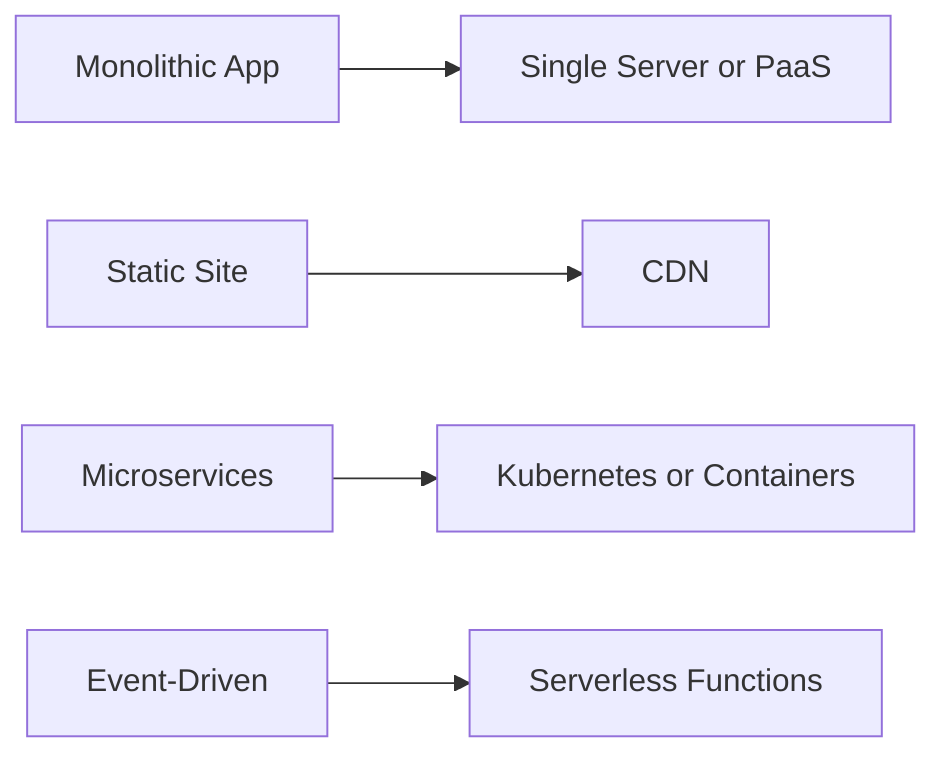
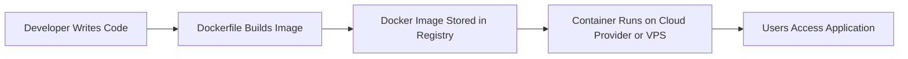
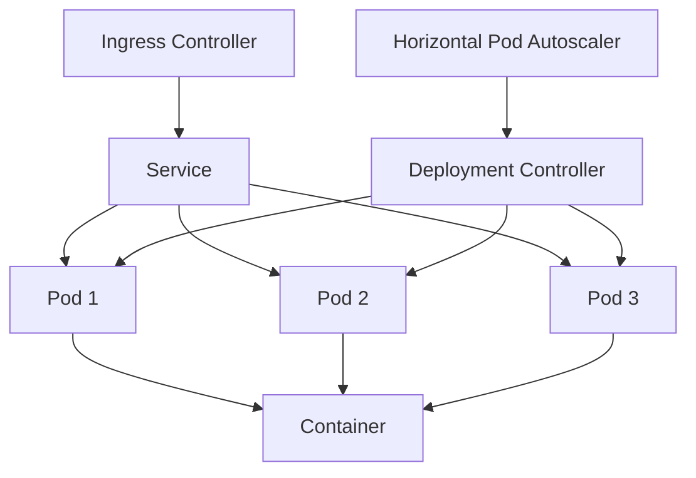
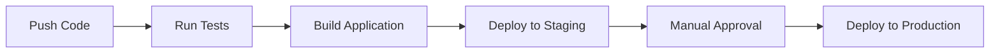

# The Modern Web Application Deployment Guide

A practical, beginner-friendly yet technically deep reference for deploying web applications in 2026.

---

## Table of Contents

1. [Introduction](#1-introduction)
2. [Frontend Hosting](#2-frontend-hosting)
3. [Backend as a Service (BaaS)](#3-backend-as-a-service-baas)
4. [Docker](#4-docker)
5. [Platform as a Service (PaaS)](#5-platform-as-a-service-paas)
6. [VPS (Virtual Private Server)](#6-vps-virtual-private-server)
7. [Cloud Providers (IaaS)](#7-cloud-providers-iaas)
8. [Kubernetes](#8-kubernetes)
9. [Serverless Computing](#9-serverless-computing)
10. [Edge Computing](#10-edge-computing)
11. [Comparing All Deployment Options](#11-comparing-all-deployment-options)
12. [Deployment Recommendations](#12-deployment-recommendations)
13. [Best Practices](#13-best-practices)
14. [Conclusion](#14-conclusion)

---

## 1. Introduction

### What Is Application Deployment?

**Deployment** is the process of making your application available to users on the internet. It involves taking code from your local machine or repository, building it, placing it on servers (or serverless platforms), configuring networking, securing it, and keeping it running.

In simple terms: if development is *building the house*, deployment is *moving it to a live address where people can visit*.

### Hosting vs. Deployment vs. Infrastructure

These three terms are related but not interchangeable:

| Term | Definition | Example |
|------|-----------|---------|
| **Hosting** | Where your application physically or virtually lives. | A server on AWS, a Vercel edge node. |
| **Deployment** | The act of publishing and updating your application. | Pushing code to GitHub and triggering a build. |
| **Infrastructure** | The underlying resources needed to run software. | Servers, databases, load balancers, networks. |

> **Note:** You can deploy an application without managing infrastructure (e.g., Vercel), or you can manage every layer yourself (e.g., a bare-metal server).

### Common Deployment Architectures

Modern applications usually follow one of these patterns:

- **Static Site:** Frontend only (HTML, CSS, JavaScript). Hosted on a CDN.
- **Full-Stack Application:** Frontend + backend API + database.
- **Microservices:** Application split into many small, independent services.
- **Serverless / Event-Driven:** Code runs only in response to events (HTTP requests, file uploads, timers).
- **Containerized:** Application packaged with Docker and run on cloud providers or Kubernetes.



---

## 2. Frontend Hosting

### What Is Frontend Hosting?

Frontend hosting is designed for applications that run entirely in the browser: React, Vue, Svelte, Next.js static exports, Angular, Hugo, Astro, and plain HTML/CSS/JS sites. These platforms compile your code, distribute it across a global CDN, and serve it with HTTPS automatically.

### When to Use Frontend Hosting

Use frontend hosting when:

- Your app is a static site or single-page application (SPA).
- You want fast global performance via CDN.
- You want automatic deployments from Git.
- You do not need a persistent backend running 24/7.

### Popular Platforms

#### Vercel

Vercel is the creator of Next.js and offers deep integration with React frameworks. It supports server-side rendering (SSR), API routes, edge functions, and image optimization.

**Best for:** Next.js, React, and frontend-first projects.

#### Netlify

Netlify pioneered git-based deployments and offers features like branch previews, forms, identity, edge functions, and a large plugin ecosystem.

**Best for:** Static sites, JAMstack apps, and marketing sites.

#### Cloudflare Pages

Cloudflare Pages combines static hosting with Cloudflare's massive global network. It integrates tightly with Cloudflare Workers for backend logic at the edge.

**Best for:** Static sites needing global edge performance and low latency.

### Key Features Discussed

| Feature | Description |
|--------|-------------|
| **Git-Based Deployments** | Push to GitHub/GitLab/Bitbucket and the platform builds and deploys automatically. |
| **CDN** | Your site is cached on servers around the world for fast load times. |
| **Automatic HTTPS** | SSL certificates are provisioned and renewed automatically. |
| **Preview Deployments** | Every pull request gets its own live URL for testing. |
| **Custom Domains** | Point your own domain to the hosted site with DNS configuration. |

### Typical Use Cases

- Personal portfolios and blogs
- Marketing landing pages
- Documentation sites
- Prototypes and demo apps
- SPAs backed by a separate API

> **Tip:** If you need server-side rendering or API routes, Vercel and Netlify handle these. For purely static sites, Cloudflare Pages is often the fastest globally.

---

## 3. Backend as a Service (BaaS)

### What Is BaaS?

**Backend as a Service (BaaS)** provides ready-made backend features so developers can focus on frontend and business logic instead of building servers from scratch. BaaS platforms typically offer authentication, databases, file storage, realtime subscriptions, and serverless functions.

Think of BaaS as *leasing a fully furnished backend apartment* instead of building a house yourself.

### Popular BaaS Platforms

#### Supabase

Supabase is an open-source Firebase alternative built on PostgreSQL. It provides authentication, instant APIs, realtime subscriptions, storage, and edge functions.

**Best for:** Applications needing a relational database with modern developer experience.

#### Firebase

Firebase, by Google, offers a NoSQL database (Firestore), authentication, cloud storage, hosting, cloud functions, and analytics.

**Best for:** Mobile apps, real-time apps, and rapid prototyping.

#### Appwrite

Appwrite is an open-source BaaS that can be self-hosted or used as a managed cloud service. It provides authentication, databases, storage, functions, and messaging.

**Best for:** Teams who want vendor independence and open-source flexibility.

### What BaaS Covers

| Feature | What It Does |
|--------|--------------|
| **Authentication** | User signup, login, password reset, OAuth, role-based access. |
| **Databases** | Managed database with APIs and SDKs for CRUD operations. |
| **Storage** | File uploads, image handling, and access control. |
| **Realtime** | Live data sync across clients (chat, dashboards, live feeds). |
| **Edge / Serverless Functions** | Run small backend scripts without managing servers. |

### Advantages and Disadvantages

| Advantages | Disadvantages |
|-----------|--------------|
| Faster development | Less control over backend architecture |
| Managed security and scaling | Vendor lock-in risk |
| Built-in realtime and auth | Can become expensive at scale |
| Great for MVPs and mobile apps | Custom logic may feel constrained |

> **Warning:** BaaS can accelerate early development, but evaluate migration paths before committing to proprietary features.

---

## 4. Docker

### What Is Docker?

Docker is a **containerization platform**. It packages your application with everything it needs to run — code, runtime, libraries, and dependencies — into a single, portable unit called a **container**.

Containers ensure that your app runs the same way on your laptop, a test server, and production.

> **Important:** Docker is **not** a hosting provider. It is a tool for packaging and running applications. You still need somewhere to run your containers.

### Core Concepts

| Concept | Explanation |
|--------|-------------|
| **Image** | A read-only blueprint for creating containers. |
| **Container** | A running instance of an image. |
| **Dockerfile** | A script that defines how to build a Docker image. |
| **Docker Compose** | A tool for defining and running multi-container applications. |

### Dockerfile Example

```dockerfile
FROM node:20-alpine
WORKDIR /app
COPY package*.json ./
RUN npm install
COPY . .
EXPOSE 3000
CMD ["node", "server.js"]
```

### Docker Compose Example

```yaml
version: "3.8"
services:
  app:
    build: .
    ports:
      - "3000:3000"
  db:
    image: postgres:15
    environment:
      POSTGRES_PASSWORD: example
```

### Deployment Flow



### Where Docker Can Run

Docker images can run almost anywhere:

- **AWS:** ECS, EKS, EC2, Lambda (with container support)
- **Azure:** Container Instances, AKS, App Service
- **Google Cloud:** Cloud Run, GKE, Compute Engine
- **PaaS:** Railway, Render, Fly.io
- **VPS:** Any Linux server with Docker installed
- **Kubernetes:** The standard orchestrator for container fleets

> **Tip:** If your app has more than one service (e.g., app + database + cache), start with Docker Compose locally before moving to cloud containers.

---

## 5. Platform as a Service (PaaS)

### What Is PaaS?

**Platform as a Service (PaaS)** gives developers a platform to deploy, run, and scale applications without managing the underlying infrastructure. You provide the code (and optionally a Docker container), and the platform handles servers, networking, scaling, and often databases.

PaaS sits between frontend hosting and full cloud providers in terms of complexity.

### Popular PaaS Platforms

#### Railway

Railway offers an intuitive developer experience with automatic deployments, managed databases, environment variables, and scaling. It supports both git-based and Docker deployments.

**Best for:** Full-stack apps, APIs, and side projects that outgrow free tiers.

#### Render

Render provides static sites, web services, databases, Redis, and background workers. It is known for predictable pricing and easy configuration.

**Best for:** Startups and production apps needing a simple, reliable PaaS.

#### Fly.io

Fly.io runs applications close to users by deploying containers globally on the edge. It is ideal for apps requiring low latency in many regions.

**Best for:** Global applications, edge workloads, and Dockerized services.

### PaaS Features

| Feature | Description |
|--------|-------------|
| **Git Deployments** | Push code and the platform builds and deploys automatically. |
| **Docker Support** | Deploy containers instead of relying on language-specific buildpacks. |
| **Automatic Scaling** | Scale horizontally or vertically based on traffic. |
| **Managed Infrastructure** | No need to patch servers or configure load balancers. |

### Pros and Cons

| Pros | Cons |
|------|------|
| Fast time to production | Less control than IaaS |
| Managed databases and networking | Can be more expensive than VPS at scale |
| Easy scaling | Potential vendor lock-in |
| Great developer experience | Custom infrastructure needs may be limited |

---

## 6. VPS (Virtual Private Server)

### What Is a VPS?

A **Virtual Private Server (VPS)** is a virtual machine rented from a cloud or hosting provider. You get root access to a Linux server and are responsible for installing, configuring, securing, and maintaining everything.

A VPS is like renting an empty apartment: you have full control, but you also do all the work.

### Popular VPS Providers

- **DigitalOcean:** Known for simplicity, great documentation, and predictable pricing.
- **Hetzner:** Budget-friendly, popular in Europe, good performance.
- **Linode (Akamai):** Reliable, long-standing provider with global data centers.

### What You Manage on a VPS

| Task | Tools |
|------|-------|
| **Remote Access** | SSH |
| **Operating System** | Ubuntu, Debian, Rocky Linux |
| **Web Server / Reverse Proxy** | Nginx, Caddy, Apache |
| **SSL Certificates** | Let's Encrypt, Certbot, Caddy (automatic HTTPS) |
| **Application Runtime** | Node.js, Python, Go, Docker |
| **Database** | PostgreSQL, MySQL, MongoDB |
| **Process Management** | systemd, PM2, Docker Compose |

### Reverse Proxy Example with Nginx

```nginx
server {
    listen 80;
    server_name example.com;

    location / {
        proxy_pass http://localhost:3000;
        proxy_set_header Host $host;
        proxy_set_header X-Real-IP $remote_addr;
    }
}
```

### Who Should Choose a VPS?

Choose a VPS if:

- You want full control and lower cost.
- You are comfortable with Linux administration.
- You need custom server configurations.
- You are learning how deployment actually works.

> **Warning:** Running a VPS means you are responsible for security updates, backups, and uptime. Do not expose databases or admin panels to the public internet without firewalls and authentication.

---

## 7. Cloud Providers (IaaS)

### What Is IaaS?

**Infrastructure as a Service (IaaS)** provides raw computing resources over the internet: virtual machines, storage, networking, and databases. Cloud providers offer massive scalability, managed services, and enterprise-grade features — but with significant complexity.

The three largest providers are **AWS**, **Microsoft Azure**, and **Google Cloud Platform (GCP)**.

### AWS (Amazon Web Services)

AWS is the largest cloud provider with the broadest service catalog.

| Service | Purpose |
|---------|---------|
| **EC2** | Virtual servers |
| **ECS** | Managed container service |
| **EKS** | Managed Kubernetes |
| **Lambda** | Serverless functions |
| **S3** | Object storage |
| **RDS** | Managed relational databases |
| **CloudFront** | CDN |
| **Route53** | DNS management |

### Microsoft Azure

Azure integrates deeply with Microsoft products and enterprise environments.

| Service | Purpose |
|---------|---------|
| **Virtual Machines** | Virtual servers |
| **Azure App Service** | Managed PaaS for web apps |
| **AKS** | Managed Kubernetes |
| **Azure Functions** | Serverless functions |
| **Blob Storage** | Object storage |
| **Azure SQL** | Managed SQL Server database |

### Google Cloud Platform (GCP)

GCP is known for data analytics, machine learning, and container-native services.

| Service | Purpose |
|---------|---------|
| **Compute Engine** | Virtual servers |
| **Cloud Run** | Serverless containers |
| **GKE** | Managed Kubernetes |
| **Cloud Functions** | Serverless functions |
| **Cloud Storage** | Object storage |
| **Cloud SQL** | Managed relational databases |

### IaaS Concepts

| Concept | Explanation |
|--------|-------------|
| **Managed Services** | Cloud provider handles maintenance, backups, and scaling. |
| **Scalability** | Add or remove resources automatically based on demand. |
| **Pricing Complexity** | Pay for what you use, but billing can be hard to predict. |
| **Enterprise Use Cases** | Compliance, multi-region, hybrid cloud, and large-scale systems. |

> **Tip:** Start with managed services (e.g., RDS, Cloud Run, Azure App Service) instead of building everything on raw VMs. They reduce operational burden significantly.

---

## 8. Kubernetes

### Why Kubernetes Exists

**Kubernetes (K8s)** is an open-source system for automating the deployment, scaling, and management of containerized applications. It was created because running many containers across many machines manually is extremely complex.

Kubernetes is the industry standard for container orchestration.

### Core Concepts

| Concept | Explanation |
|--------|-------------|
| **Pod** | The smallest deployable unit, usually one or more containers. |
| **Deployment** | Defines how many pod replicas should run and how to update them. |
| **Service** | Exposes pods to network traffic internally or externally. |
| **Ingress** | Routes external HTTP/HTTPS traffic to services. |
| **Autoscaling** | Automatically adds or removes pods based on CPU, memory, or custom metrics. |
| **Rolling Updates** | Replaces old pods with new ones gradually to avoid downtime. |

### Kubernetes Architecture



### When to Use Kubernetes

Use Kubernetes when:

- You run many microservices.
- You need advanced scaling, rolling updates, and self-healing.
- You have dedicated DevOps or platform engineering resources.
- You operate at scale where PaaS becomes limiting or expensive.

> **Warning:** Kubernetes has a steep learning curve. Do not adopt it prematurely for simple apps. Managed Kubernetes (EKS, AKS, GKE) reduces but does not eliminate operational complexity.

---

## 9. Serverless Computing

### What Is Serverless?

**Serverless computing** lets you run code without provisioning or managing servers. You write functions that execute in response to events, and the cloud provider handles scaling, patching, and availability.

You pay only for the requests and compute time you actually use.

### Key Characteristics

| Concept | Explanation |
|--------|-------------|
| **Event-Driven** | Functions run in response to triggers like HTTP requests, file uploads, or scheduled timers. |
| **Pay-Per-Request** | Billing is based on invocations and execution duration, not idle server time. |
| **Cold Starts** | A short latency occurs when a function wakes up after being idle. |

### Popular Serverless Platforms

- **AWS Lambda**
- **Cloudflare Workers**
- **Google Cloud Functions**
- **Azure Functions**

### Serverless vs. Traditional Servers

| Factor | Serverless | Traditional Servers |
|--------|------------|---------------------|
| **Management** | None | High |
| **Scaling** | Automatic | Manual or configured |
| **Cost Model** | Pay per use | Pay for uptime |
| **Cold Starts** | Yes | No |
| **Long-Running Tasks** | Limited | Ideal |
| **State** | Stateless by design | Can hold state |

### When to Use Serverless

Use serverless for:

- APIs with variable traffic
- Image or file processing
- Scheduled tasks and cron jobs
- Webhooks
- Event-driven workflows

> **Tip:** Cloudflare Workers are designed to minimize cold starts by running on V8 isolates rather than traditional containers, making them excellent for low-latency edge functions.

---

## 10. Edge Computing

### What Is Edge Computing?

**Edge computing** runs code on servers geographically close to users, rather than in a centralized data center. This reduces latency, improves performance, and enables dynamic personalization at scale.

Instead of routing a user in Tokyo to a server in Virginia, edge computing runs logic in Tokyo.

### Key Benefits

| Benefit | Description |
|--------|-------------|
| **Global Execution** | Code runs in hundreds of locations worldwide. |
| **Low Latency** | Reduced round-trip time for users everywhere. |
| **Dynamic at the Edge** | Personalize content, A/B tests, and authentication close to users. |

### Popular Edge Platforms

- **Cloudflare Workers:** Runs JavaScript, TypeScript, Rust, and Python at the edge.
- **Vercel Edge Functions:** Serverless functions deployed to Vercel's edge network.
- **Deno Deploy:** Modern edge runtime built on Deno, TypeScript-native.

### Edge Use Cases

- Geolocation-based content
- Authentication middleware
- A/B testing and feature flags
- Bot detection and rate limiting
- Real-time personalization

> **Note:** Edge computing is not a replacement for databases or long-running backends. It is best for lightweight, latency-sensitive logic.

---

## 11. Comparing All Deployment Options

| Platform | Difficulty | Cost | Scalability | Flexibility | Learning Curve | Best For | Server Management | Supports Docker |
|----------|-----------|------|-------------|-------------|----------------|----------|-------------------|-----------------|
| **Vercel** | Easy | Low-Medium | High | Medium | Low | Next.js / React frontends | No | Limited |
| **Netlify** | Easy | Low-Medium | High | Medium | Low | Static sites, JAMstack | No | Limited |
| **Cloudflare Pages** | Easy | Low | Very High | Medium | Low | Global static sites | No | Limited |
| **Supabase** | Easy | Low-Medium | High | Medium | Low | Apps needing PostgreSQL backend | No | No |
| **Firebase** | Easy | Low-Medium | High | Medium | Low | Mobile apps, real-time apps | No | No |
| **Railway** | Easy | Medium | Medium | Medium | Low | Full-stack apps, APIs | No | Yes |
| **Render** | Easy | Medium | Medium | Medium | Low | Startups, production PaaS | No | Yes |
| **Fly.io** | Medium | Medium | High | High | Medium | Global container apps | No | Yes |
| **VPS** | Medium | Low | Medium | Very High | Medium | Learning, full control | Yes | Yes |
| **AWS** | Hard | Variable | Very High | Very High | High | Enterprise, complex systems | Partial | Yes |
| **Azure** | Hard | Variable | Very High | Very High | High | Microsoft ecosystems, enterprise | Partial | Yes |
| **Google Cloud** | Hard | Variable | Very High | Very High | High | Data/ML workloads, containers | Partial | Yes |
| **Kubernetes** | Very Hard | Medium-High | Very High | Very High | Very High | Large-scale microservices | Yes | Yes |

> **Note:** "Server Management" refers to how much you must manage. PaaS and serverless abstract it; IaaS and Kubernetes still require significant operations work.

---

## 12. Deployment Recommendations

| Scenario | Recommended Stack | Why |
|----------|-------------------|-----|
| **Personal Portfolio** | Vercel / Netlify / Cloudflare Pages | Free, fast, and effortless. |
| **Student Projects** | Vercel + GitHub + Supabase or Firebase | Free tiers, easy learning, full-stack capable. |
| **Small SaaS** | Next.js on Vercel + Supabase or Railway | Rapid development with managed backend. |
| **Startup MVP** | Railway / Render + PostgreSQL | Fast deployment, reasonable cost, room to grow. |
| **Growing Startup** | AWS / GCP / Azure with managed services | Better control, scaling, and compliance options. |
| **Medium Business** | AWS / Azure / GCP + Kubernetes or managed containers | Reliability, observability, and team specialization. |
| **Enterprise** | AWS / Azure / GCP + Kubernetes + multi-region | Compliance, security, and global resilience. |
| **High-Traffic Applications** | Cloud provider + CDN + Kubernetes + auto-scaling + caching | Handle massive load with redundancy. |

### Example Technology Stacks

- **Portfolio:** Astro + Cloudflare Pages
- **Student Project:** React + Vercel + Supabase
- **Small SaaS:** Next.js + Vercel + Supabase Auth + Stripe
- **Startup MVP:** Node.js/Express + Railway + PostgreSQL
- **Growing Startup:** Docker + AWS ECS + RDS + S3 + CloudFront
- **Enterprise:** Kubernetes (EKS/AKS/GKE) + Terraform + CI/CD + multi-region

---

## 13. Best Practices

### Environment Variables

- Never commit secrets to Git.
- Use `.env` files locally and platform secret managers in production.
- Separate variables per environment (development, staging, production).

### CI/CD

**Continuous Integration / Continuous Deployment** automates testing and deployment.

Typical flow:



### GitHub Actions

A common GitHub Actions workflow:

```yaml
name: Deploy
on:
  push:
    branches: [main]
jobs:
  deploy:
    runs-on: ubuntu-latest
    steps:
      - uses: actions/checkout@v4
      - uses: actions/setup-node@v4
        with:
          node-version: 20
      - run: npm ci
      - run: npm run build
      - run: npm run deploy
```

### Monitoring

- Use tools like Datadog, New Relic, Grafana, or cloud-native monitoring.
- Track uptime, response times, error rates, and resource usage.

### Logging

- Centralize logs with services like Datadog, LogRocket, or cloud logging.
- Use structured logging (JSON) for easier parsing.

### Backups

- Automate database backups daily or more frequently.
- Test restoration procedures regularly.
- Store backups in a different region for disaster recovery.

### Secrets Management

- Use AWS Secrets Manager, Azure Key Vault, GCP Secret Manager, or HashiCorp Vault.
- Rotate secrets periodically.
- Never log secrets or expose them in frontend code.

### HTTPS

- Always use HTTPS in production.
- Use managed certificates or Let's Encrypt.
- Redirect HTTP to HTTPS automatically.

### Database Migrations

- Run migrations as part of deployment or as a separate CI step.
- Make migrations backward-compatible when possible.
- Always backup before running destructive migrations.

### Rollbacks

- Keep previous deployment versions available.
- Use blue-green deployments or canary releases for safer updates.
- Have a documented rollback procedure.

### Scaling Strategies

| Strategy | When to Use |
|----------|-------------|
| **Vertical Scaling** | Increase server size for CPU/memory-bound apps. |
| **Horizontal Scaling** | Add more servers behind a load balancer. |
| **Auto-Scaling** | Let the platform add/remove resources based on demand. |
| **Caching** | Reduce database load with Redis or CDN caching. |
| **Database Read Replicas** | Scale read-heavy applications. |

> **Tip:** Start simple. Optimize and scale only after measuring real bottlenecks.

---

## 14. Conclusion

### When to Use Each Option

- **Frontend hosting** for static sites and SPAs.
- **BaaS** when you want to ship fast without building a backend.
- **PaaS** when you need a backend but do not want to manage infrastructure.
- **Docker** when you need portability and consistent environments.
- **VPS** when you want control, low cost, and are willing to manage servers.
- **Cloud providers (IaaS)** when you need scalability, enterprise features, and managed services.
- **Kubernetes** when you operate complex, large-scale containerized systems.
- **Serverless** for event-driven, variable-traffic, or cost-optimized workloads.
- **Edge computing** for low-latency, globally distributed logic.

### Suggested Learning Path

1. **Vercel** — Deploy your first frontend.
2. **Supabase** — Add a managed backend.
3. **Railway / Render** — Deploy a full-stack application.
4. **Docker** — Containerize your app for portability.
5. **VPS** — Learn Linux, Nginx, and server management.
6. **AWS / Azure / Google Cloud** — Explore enterprise cloud services.
7. **Kubernetes** — Master container orchestration at scale.

This progression moves from abstraction and speed toward control and complexity. Choose the right tool for your current project, team size, and operational maturity.

---

*Happy deploying!*
